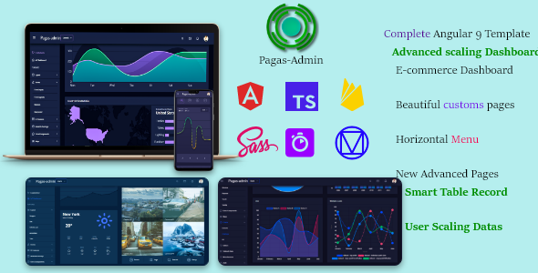

# pagas-admin

        
    

        

        "Pagas-Admin" is powerful admin Dashboard for scaling data, is a template base on ngx-admin
         build with custom design, build with Angular 9 and angular CLI. it comes with pre-intergrated
         feature required for your angular app. it is developed with an approach to provide user dashboard
         Whatever you need for your project backend is already intergrated on Pagas-admin like text editors, chart, e-chart,
         3D js, maps, email pages, register, login, lots of features.
          
           
           
           
         The dashboard comes with like SASS, Web Analytics, Crypto, CRM, Ecommerce and Themes. it has lost of 
         ready to use pages like email, chat, User Management, Session Pages, custom button, Toast, Animation Search
         miscellaneous, etc.
        

    

    
     
     
     
    

        
Features

        

        <ul>
            <li>Angular 9</li>
            <li>Bootstrap 4</li>
            <li>Fully Responsive Layouts</li>
            <li>Built-in Apps</li>
            <li>Well Documented</li>
            <li>Custom Component</li>
            <li>Map leaflet</li>
            <li>Iot Dashboard</li>
            <li>Custom Layout</li>
            <li>UI Features</li>
            <li>Auth</li>
            <li>E.T.C</li>
        </ul>
    

    

        
Get started

        

        <ul>
            <li>
                <h3>unzip the file.</h3>
            </li>
            <li>
                <h3>open the file , make sure your current folder in your IDE or visual studio code.</h3>
            </li>
            <li>
                <h3>navigate to your terminal</h3>
            </li>
            <li>
                <h3>npm install</h3>
            </li>
            <li>
                <h3>ng serve </h3>
            </li>
            <li>
                <h3>ng build </h3>
            </li>
        </ul>
    

